<div align="center">


<p align="center">
  
</p>

<br/>
<br>

<br>

<div align="center">

<br>

<details open>

<summary>
  <strong>✦ IDENTIDADE VISUAL — AURENA</strong>
</summary>

<br>

<div align="center">

<a href="./assets/aurena-logo.png">
  
</a>

<br>

<sub>
  Clique na imagem para visualizar em alta resolução
</sub>

<br><br>

<strong>
  Dados que transformam representatividade em decisão
</strong>

<br>

<sub>
  PROFUNDIDADE · SUBTOM · ACESSO · EVIDÊNCIA
</sub>

</div>

<br>

</details>

<br>

---

<br>

## 01 — VISÃO GERAL

<h3 align="center">Da representatividade à decisão</h3>

<p align="center">
  <sub>
    Uma análise orientada por dados para investigar se a oferta de maquiagem<br>
    acompanha a diversidade das peles brasileiras.
  </sub>
</p>

<br>

> **VISÃO DO PROJETO**  
> Beleza sem Lacunas analisa como tonalidades, subtons, preços, disponibilidade e qualidade das evidências ajudam a revelar oportunidades de inclusão no mercado brasileiro de cosméticos.

<br>

### O ponto de partida

**Beleza sem Lacunas** é um projeto de análise de dados que investiga se a oferta de maquiagem no mercado brasileiro acompanha a diversidade das peles brasileiras.

A análise vai além da quantidade de cores anunciada por uma marca. O projeto considera também:

| PROFUNDIDADE | SUBTOM | ACESSO | EVIDÊNCIA |
|:--:|:--:|:--:|:--:|
| Presença de tons escuros, profundos e retintos | Diversidade entre famílias quentes, frias, neutras e oliva | Preço, promoções e disponibilidade | Fonte, método de classificação e nível de confiança |

<br>

### Questão central

> **As marcas oferecem variedade e acesso suficientes para atender peles negras, escuras e retintas com qualidade e representatividade?**

<br>

### Da lacuna à oportunidade


<br>

### Problema e oportunidade

| O PROBLEMA | A ANÁLISE | A OPORTUNIDADE |
|:--|:--|:--|
| Uma cartela extensa pode continuar apresentando lacunas quando poucos tons contemplam peles profundas ou quando a variedade de subtons é insuficiente. | Comparar a oferta de tons com outros fatores, evitando avaliar inclusão apenas pela quantidade anunciada. | Transformar representatividade em evidência para apoiar decisões de produto, posicionamento, estoque, preço e comunicação. |

<br>

### Dimensões investigadas

| DIMENSÃO | O QUE SERÁ OBSERVADO | CONTRIBUIÇÃO PARA O PROJETO |
|:--|:--|:--|
| **Oferta** | Quantidade e distribuição das tonalidades. | Identificar quais marcas possuem cartelas mais amplas. |
| **Profundidade** | Presença de tons escuros, profundos e retintos. | Verificar se a diversidade alcança diferentes intensidades de pele. |
| **Subtom** | Famílias quentes, frias, neutras e oliva. | Avaliar se existem opções além da profundidade da cor. |
| **Preço** | Valores regulares e promocionais. | Relacionar representatividade com acessibilidade. |
| **Disponibilidade** | Presença dos produtos na data da coleta. | Identificar possíveis lacunas de estoque e acesso. |
| **Evidência** | Fonte, data, método e nível de confiança. | Garantir transparência e rastreabilidade às comparações. |

<br>

### Resultado esperado

<table>
<tr>
<td align="center" width="33%"><strong>COMPREENDER</strong><br><br>Como o mercado organiza<br>sua oferta de tons</td>
<td align="center" width="34%"><strong>IDENTIFICAR</strong><br><br>Padrões, desigualdades<br>e lacunas de inclusão</td>
<td align="center" width="33%"><strong>TRANSFORMAR</strong><br><br>Evidências em decisões<br>estratégicas para a Aurena</td>
</tr>
</table>

<br>

> **Direção estratégica:** o projeto não busca apenas mostrar quantas cores existem. Ele procura compreender para quem essas cores existem, como estão distribuídas e quais consumidores ainda podem estar pouco representados.

<br>

---

<br>

## 02 — DIFERENCIAL DO PROJETO


<br>

A identidade da Aurena foi conectada à análise de maneira funcional. Os elementos do universo da maquiagem não aparecem apenas como decoração: eles representam dimensões reais do estudo.

<table>
  <tr>
    <th width="25%">PROFUNDIDADE</th>
    <th width="25%">SUBTOM</th>
    <th width="25%">ACESSO</th>
    <th width="25%">EVIDÊNCIA</th>
  </tr>
  <tr>
    <td valign="top">Presença de tons escuros, profundos e retintos.</td>
    <td valign="top">Diversidade entre famílias quentes, frias, neutras e oliva.</td>
    <td valign="top">Preço regular, promoção e disponibilidade observada.</td>
    <td valign="top">Fonte, data de acesso, método de classificação e confiança.</td>
  </tr>
</table>

<br>

Categorias observadas

<div align="center">


</div>

<br>
<br>

<br>

---

<br>

## 03 — DIMENSÃO DA PESQUISA

<h3 align="center">Um panorama amplo do mercado de maquiagem</h3>

<p align="center">
  <sub>
    O projeto reúne marcas, linhas de produtos, tonalidades e fontes<br>
    para construir uma análise comparativa, rastreável e orientada por dados.
  </sub>
</p>

<br>

> **ESCOPO DA ANÁLISE**  
> A pesquisa foi estruturada para observar não apenas a quantidade de cores disponíveis, mas também como essa oferta está distribuída entre diferentes marcas, produtos e níveis de profundidade.

<br>

### Visão geral da base

| MARCAS ANALISADAS | LINHAS DE PRODUTOS | TONALIDADES | FONTES REGISTRADAS |
|:--:|:--:|:--:|:--:|
| **12** | **23** | **175** | **29** |
| Empresas presentes na pesquisa | Produtos e coleções avaliados | Cores registradas na base | Evidências utilizadas na análise |

<br>

### Estrutura do levantamento

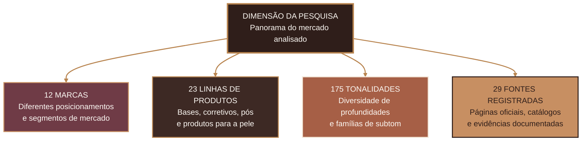

<br>

### O que cada indicador representa

| INDICADOR | O QUE FOI CONSIDERADO | CONTRIBUIÇÃO PARA A ANÁLISE |
|:--|:--|:--|
| **12 marcas** | Empresas nacionais e marcas comercializadas no mercado brasileiro. | Permite comparar diferentes estratégias de inclusão e posicionamento. |
| **23 linhas de produtos** | Coleções e produtos voltados à maquiagem da pele. | Evita avaliar uma marca inteira com base em apenas um produto. |
| **175 tonalidades** | Cores identificadas nas cartelas analisadas. | Possibilita investigar profundidade, distribuição e variedade da oferta. |
| **29 fontes** | Páginas, catálogos e registros utilizados durante a coleta. | Aumenta a rastreabilidade e permite conferir as informações utilizadas. |

<br>

### Marcas presentes na pesquisa

|  |  |  |
|:--:|:--:|:--:|
| **Negra Rosa** | **Dailus** | **Bruna Tavares** |
| **Vizzela** | **Natura** | **O Boticário / Make B.** |
| **Boca Rosa** | **Eudora** | **Avon** |
| **Ruby Rose** | **Mari Maria Makeup** | **Catharine Hill** |

<br>

### Diferentes perspectivas do mercado

| PORTFÓLIO | REPRESENTATIVIDADE | ACESSO | EVIDÊNCIA |
|:--:|:--:|:--:|:--:|
| Quantidade de linhas e tonalidades | Presença de tons profundos e retintos | Preço e disponibilidade | Qualidade e rastreabilidade das fontes |
| Amplitude da oferta | Diversidade de subtons | Possibilidade de compra | Segurança das comparações |

<br>

### Como a dimensão da pesquisa fortalece o projeto

| AMPLITUDE | PROFUNDIDADE | COMPARABILIDADE |
|:--:|:--:|:--:|
| Reúne diferentes marcas e linhas de maquiagem | Analisa tonalidades além da quantidade anunciada | Utiliza critérios iguais para organizar as informações |
| Observa diferentes posicionamentos de mercado | Considera profundidade, subtom, preço e disponibilidade | Mantém fontes e evidências associadas aos dados |

<br>

> **Leitura estratégica:** uma base maior não garante automaticamente uma análise melhor. O diferencial está em organizar as informações com critérios claros, separar fatos de estimativas e manter as evidências rastreáveis.

<br>

---

<br>
<br>

---

<br>

## 04 — CONTEXTO E RELEVÂNCIA

<h3 align="center">Um mercado diverso exige uma oferta igualmente diversa</h3>

<p align="center">
  <sub>
    A diversidade da população brasileira torna necessário analisar se o mercado<br>
    de cosméticos representa diferentes tons, profundidades e subtons de pele.
  </sub>
</p>

<br>

> **CONTEXTO DA ANÁLISE**  
> A representatividade no mercado de maquiagem não depende apenas da existência de produtos, mas da presença de tonalidades que atendam diferentes peles com variedade, qualidade, disponibilidade e acesso.

<br>

### Por que essa análise é relevante?

Segundo o **Censo Demográfico de 2022**, pessoas pretas e pardas representam **55,5% da população brasileira**.

Esse cenário reforça a importância de avaliar se a diversidade presente na sociedade também aparece:

| CARTELAS DE TONS | ESTOQUES | PREÇOS | COMUNICAÇÃO |
|:--:|:--:|:--:|:--:|
| Variedade de profundidades e subtons | Disponibilidade dos produtos | Possibilidade real de acesso | Representação de diferentes peles |
| Inclusão além da quantidade anunciada | Presença dos tons mais profundos | Comparação entre linhas e marcas | Posicionamento inclusivo das empresas |

<br>

### Da diversidade populacional à análise de mercado


<br>

### O desafio da representatividade

| DESAFIO | COMO PODE APARECER NO MERCADO | IMPACTO |
|:--|:--|:--|
| **Baixa profundidade da cartela** | Poucas opções destinadas a peles escuras, profundas ou retintas. | Consumidores podem não encontrar uma tonalidade adequada. |
| **Pouca variedade de subtons** | Concentração de opções quentes, frias ou neutras. | A cor pode ter profundidade próxima, mas não harmonizar com a pele. |
| **Indisponibilidade** | Tons existem na cartela, mas não estão disponíveis para compra. | A inclusão anunciada não se transforma em acesso real. |
| **Preço elevado** | Linhas mais diversas apresentam valores pouco acessíveis. | A variedade existe, mas não alcança todos os consumidores. |
| **Evidência insuficiente** | Informações incompletas ou pouco claras sobre tons e subtons. | Dificulta comparações responsáveis entre produtos e marcas. |

<br>

### Representatividade além da quantidade

Uma cartela com muitas tonalidades pode parecer inclusiva à primeira vista. Entretanto, a quantidade total não mostra, sozinha, como as opções estão distribuídas.

| QUANTIDADE | DISTRIBUIÇÃO | ACESSO | QUALIDADE DA INFORMAÇÃO |
|:--:|:--:|:--:|:--:|
| Quantos tons existem? | Quais profundidades e subtons estão presentes? | Os produtos estão disponíveis e possuem preço acessível? | As informações podem ser verificadas? |
| Mede a amplitude da cartela | Mostra quem está representado | Indica a possibilidade real de compra | Aumenta a confiança da análise |

<br>

### O que o projeto busca compreender

| MERCADO | CONSUMIDOR | OPORTUNIDADE |
|:--|:--|:--|
| Como as marcas organizam suas cartelas de tons | Quais públicos podem continuar pouco atendidos | Onde existe espaço para ampliar a inclusão |
| Como preços e estoques interferem no acesso | Se profundidade e subtom aparecem de forma equilibrada | Como a Aurena pode tomar decisões orientadas por dados |
| Quais informações possuem evidências suficientes | Se a variedade anunciada representa diversidade real | Como transformar lacunas em estratégia de produto |

<br>

### Relevância para a Aurena

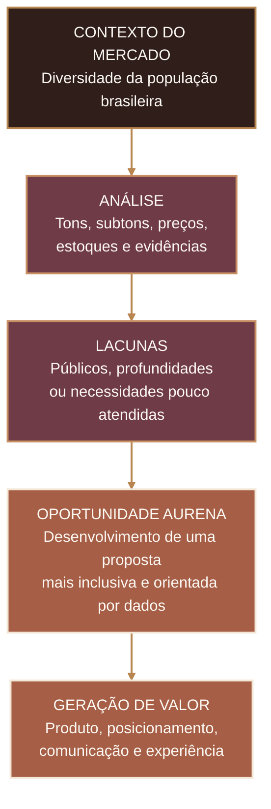

<br>

### Contribuição do projeto

| EVIDÊNCIA | REPRESENTATIVIDADE | DECISÃO |
|:--:|:--:|:--:|
| Dados registrados e rastreáveis | Diversidade analisada além da quantidade | Oportunidades transformadas em recomendações |
| Comparações baseadas em critérios | Profundidade e subtom considerados | Apoio ao desenvolvimento de produtos |
| Limitações apresentadas com transparência | Acesso relacionado a preço e estoque | Estratégias de posicionamento e comunicação |

<br>

> **Leitura estratégica:** analisar inclusão significa investigar não apenas quantas tonalidades estão disponíveis, mas também quais peles são contempladas, como os tons estão distribuídos e se os consumidores conseguem realmente acessar esses produtos.

<br>

### Fonte demográfica

**IBGE — Censo Demográfico 2022:**  
[Um Brasil preto e pardo](https://educa.ibge.gov.br/criancas/brasil/2848-nosso-povo/23072-um-brasil-preto-e-pardo.html)

<br>

---

<br>

<br>

---

<br>

<br>

---

<br>

## 05 — PERGUNTAS DO NEGÓCIO

<h3 align="center">O que os dados precisam revelar?</h3>

<p align="center">
  <sub>
    O projeto parte de perguntas estratégicas para avaliar oferta, representatividade,<br>
    acesso e oportunidades no mercado brasileiro de maquiagem.
  </sub>
</p>

<br>

> **QUESTÃO NORTEADORA**  
> A quantidade de tonalidades oferecida pelas marcas representa, de fato, a diversidade das peles brasileiras?

<br>

### Painel de investigação

| EIXO ANALÍTICO | QUESTÃO CENTRAL |
|:--|:--|
| **Oferta** | Quais marcas e linhas apresentam as maiores cartelas de tonalidades? |
| **Representatividade** | A amplitude da cartela contempla peles escuras, profundas e retintas? |
| **Subtom** | Existe variedade entre famílias quentes, frias, neutras e oliva? |
| **Acesso** | A diversidade anunciada está disponível e possui preço acessível? |
| **Evidência** | As informações disponíveis são suficientes para comparações confiáveis? |
| **Estratégia** | Quais lacunas podem se transformar em oportunidades para a Aurena? |

<br>

<div align="center">

### Explore os eixos da análise

<sub>
Clique em cada bloco para visualizar as perguntas, os indicadores<br>
e as decisões relacionadas a cada dimensão.
</sub>

</div>

<br>

<details open>

<summary><strong>01 · OFERTA E AMPLITUDE DAS CARTELAS</strong></summary>

<br>

#### Perguntas investigadas

- Quais marcas possuem as maiores cartelas de tons?
- Quais linhas de produtos concentram a maior quantidade de tonalidades?
- Uma cartela maior significa, necessariamente, maior inclusão?

#### Indicadores relacionados

| INDICADOR | FINALIDADE |
|:--|:--|
| Quantidade total de tonalidades | Medir a amplitude da cartela de cada produto. |
| Quantidade de linhas por marca | Observar a diversidade do portfólio analisado. |
| Distribuição percentual dos tons | Verificar como a oferta está distribuída entre as profundidades. |
| Ranking de amplitude | Comparar marcas e produtos utilizando o mesmo critério. |

#### Decisão apoiada

> Identificar quais marcas possuem maior variedade e verificar se essa amplitude está distribuída de maneira representativa.

<br>

</details>

<br>

<details>

<summary><strong>02 · PROFUNDIDADE E REPRESENTATIVIDADE</strong></summary>

<br>

#### Perguntas investigadas

- Qual é a presença confirmada de tons escuros, profundos ou retintos?
- Qual proporção da cartela é destinada às peles de maior profundidade?
- Existem diferenças relevantes entre a quantidade total de tons e a quantidade de tons profundos?

#### Indicadores relacionados

| INDICADOR | FINALIDADE |
|:--|:--|
| Tons profundos confirmados | Identificar opções destinadas às peles mais escuras. |
| Proporção de tons profundos | Comparar representatividade independentemente do tamanho da cartela. |
| Distribuição por profundidade | Avaliar o equilíbrio entre tons claros, médios, escuros e retintos. |
| Cobertura das extremidades | Verificar se a cartela contempla diferentes intensidades de pele. |

#### Decisão apoiada

> Revelar se a diversidade anunciada pelas marcas alcança diferentes profundidades ou se permanece concentrada em determinados grupos.

<br>

</details>

<br>

<details>

<summary><strong>03 · DIVERSIDADE DE SUBTONS</strong></summary>

<br>

#### Perguntas investigadas

- Quais famílias de subtom aparecem com maior frequência?
- Existem opções quentes, frias, neutras e oliva?
- Os tons profundos também apresentam variedade de subtom?
- Algumas famílias estão concentradas apenas em determinadas profundidades?

#### Indicadores relacionados

| INDICADOR | FINALIDADE |
|:--|:--|
| Quantidade de famílias de subtom | Medir a variedade de temperaturas disponíveis. |
| Frequência por subtom | Identificar famílias predominantes ou pouco representadas. |
| Subtom por profundidade | Verificar se a diversidade existe em toda a cartela. |
| Cobertura de subtom | Comparar produtos segundo a variedade de famílias identificadas. |

#### Decisão apoiada

> Avaliar se os consumidores encontram não apenas uma profundidade aproximada, mas também uma tonalidade compatível com as características da própria pele.

<br>

</details>

<br>

<details>

<summary><strong>04 · PREÇO, DISPONIBILIDADE E ACESSO</strong></summary>

<br>

#### Perguntas investigadas

- Existe diferença relevante de preço entre as linhas?
- Produtos com cartelas maiores também apresentam preços mais elevados?
- Os tons mais profundos estavam disponíveis na data da coleta?
- A oferta anunciada pelas marcas se transforma em possibilidade real de compra?

#### Indicadores relacionados

| INDICADOR | FINALIDADE |
|:--|:--|
| Preço regular | Comparar o posicionamento financeiro das linhas. |
| Preço promocional | Observar possíveis reduções e condições temporárias de acesso. |
| Preço médio por marca | Avaliar diferenças entre empresas e segmentos. |
| Percentual de disponibilidade | Identificar tonalidades disponíveis na data da coleta. |
| Disponibilidade dos tons profundos | Verificar se a inclusão anunciada estava acessível ao consumidor. |

#### Decisão apoiada

> Compreender se variedade e representatividade também estão associadas a preço competitivo e disponibilidade real.

<br>

</details>

<br>

<details>

<summary><strong>05 · QUALIDADE DAS EVIDÊNCIAS</strong></summary>

<br>

#### Perguntas investigadas

- Quais produtos possuem informações suficientes para comparação?
- Quais dados foram confirmados por fontes oficiais?
- Quais informações dependem de classificação analítica ou estimativa?
- Quais produtos podem participar do índice exploratório?

#### Indicadores relacionados

| INDICADOR | FINALIDADE |
|:--|:--|
| Cobertura de evidência | Medir o percentual de campos sustentados por informações registradas. |
| Nível de confiança | Diferenciar dados completos de registros com limitações. |
| Status de validação | Separar informações confirmadas, analíticas e estimadas. |
| Quantidade de fontes | Verificar a rastreabilidade de cada produto analisado. |

#### Regra de elegibilidade

> Um produto participa do ranking apenas quando possui pelo menos **75% de cobertura de evidências**.

#### Decisão apoiada

> Evitar comparações apoiadas em informações incompletas e preservar a transparência da análise.

<br>

</details>

<br>

<details>

<summary><strong>06 · OPORTUNIDADES PARA A AURENA</strong></summary>

<br>

#### Perguntas investigadas

- Quais lacunas podem se transformar em oportunidades para a Aurena?
- Quais profundidades aparecem com menor cobertura?
- Quais famílias de subtom estão pouco representadas?
- Em quais faixas de preço existe espaço para diferenciação?
- Como transformar os resultados em uma proposta de valor relevante?

#### Possíveis oportunidades

| DIMENSÃO | OPORTUNIDADE ESTRATÉGICA |
|:--|:--|
| **Produto** | Desenvolver uma cartela equilibrada entre profundidades e subtons. |
| **Acesso** | Combinar diversidade com preço e disponibilidade competitivos. |
| **Estoque** | Priorizar a presença contínua dos tons mais profundos. |
| **Comunicação** | Utilizar representatividade real, sustentada por produto e evidência. |
| **Experiência** | Facilitar a identificação do tom e do subtom adequado. |
| **Posicionamento** | Apresentar a Aurena como uma marca brasileira inclusiva e orientada por dados. |

#### Decisão apoiada

> Transformar padrões e lacunas do mercado em recomendações para produto, posicionamento, comunicação e experiência de compra.

<br>

</details>

<br>

### Da pergunta à decisão

| 01 | 02 | 03 | 04 |
|:--:|:--:|:--:|:--:|
| **PERGUNTAR** | **MEDIR** | **INTERPRETAR** | **DECIDIR** |
| Definir o problema de negócio | Criar indicadores verificáveis | Contextualizar padrões e limitações | Transformar evidências em estratégia |

<br>

### Entregas orientadas pelas perguntas

| ANÁLISE EM PYTHON | DASHBOARD NO POWER BI | STORYTELLING |
|:--:|:--:|:--:|
| Tratamento e comparação dos dados | Indicadores, filtros e visualizações | Conexão entre problema, evidência e oportunidade |
| Identificação de padrões e lacunas | Exploração interativa dos resultados | Recomendações estratégicas para a Aurena |
| Validação dos cálculos e fontes | Comunicação visual dos indicadores | Apresentação final orientada por dados |

<br>

> **Leitura estratégica:** cada pergunta de negócio precisa resultar em um indicador, uma interpretação e uma possível decisão. Dessa forma, o projeto não apresenta apenas números, mas explica o que eles significam para o mercado e para a Aurena.

<br>

---

<br>

<br>

---

<br>

## 06 — OBJETIVOS

<h3 align="center">Da investigação ao impacto</h3>

<p align="center">
  <sub>
    O projeto conecta pesquisa, análise e visualização para transformar<br>
    diversidade e representatividade em decisões orientadas por dados.
  </sub>
</p>

<br>

<div align="center">


</div>

<br>

> **OBJETIVO CENTRAL**  
> Avaliar o nível de inclusão das principais linhas de maquiagem comercializadas no Brasil, considerando oferta, profundidade, subtom, acesso e qualidade das evidências.

<br>

### Mapa de propósito

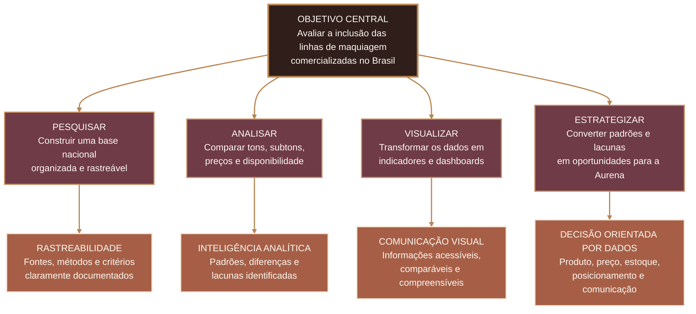

<br>

### Três movimentos estratégicos

| 01 — INVESTIGAR | 02 — MEDIR | 03 — TRANSFORMAR |
|:--:|:--:|:--:|
| Compreender como o mercado organiza sua oferta de maquiagem | Criar critérios capazes de comparar marcas e produtos | Converter resultados em recomendações para a Aurena |
| Registrar marcas, linhas, tonalidades, preços e fontes | Avaliar profundidade, subtom, acesso e evidência | Apoiar decisões de produto, posicionamento e comunicação |
| Construir uma base nacional rastreável | Identificar padrões, desigualdades e lacunas | Apresentar os insights de forma clara e estratégica |

<br>

### Objetivos específicos

| OBJETIVO | AÇÃO DESENVOLVIDA | RESULTADO ESPERADO |
|:--|:--|:--|
| **Construir uma base nacional** | Organizar marcas, produtos, tonalidades, preços e fontes. | Base estruturada, rastreável e preparada para análise. |
| **Comparar a oferta de tons** | Analisar quantidade e distribuição das tonalidades entre marcas. | Identificação das cartelas mais amplas e de possíveis concentrações. |
| **Investigar tons profundos** | Identificar opções destinadas a peles negras, escuras e retintas. | Avaliação da presença e da proporção de tons profundos. |
| **Analisar os subtons** | Comparar famílias quentes, frias, neutras e oliva. | Identificação de variedades e possíveis ausências nas cartelas. |
| **Avaliar o acesso** | Comparar preços regulares, promocionais e disponibilidade. | Compreensão da relação entre inclusão e possibilidade de compra. |
| **Identificar lacunas de estoque** | Observar a disponibilidade registrada durante a coleta. | Diferenças entre a oferta anunciada e o acesso real. |
| **Criar um índice exploratório** | Combinar dimensões de diversidade, acesso e posicionamento. | Indicador comparativo para apoiar a análise dos produtos. |
| **Desenvolver análises em Python** | Tratar, validar, explorar e comparar os dados. | Indicadores verificáveis e análises reproduzíveis. |
| **Construir visualizações no Power BI** | Modelar os dados e desenvolver painéis interativos. | Dashboard executivo para exploração dos resultados. |
| **Criar um storytelling** | Conectar problema, evidências, insights e oportunidades. | Narrativa estratégica para a apresentação final. |

<br>

### Relação entre objetivo e entrega


<br>

### Entregas conectadas aos objetivos

| DADOS | INTELIGÊNCIA | VISUALIZAÇÃO | IMPACTO |
|:--:|:--:|:--:|:--:|
| Base organizada | Indicadores comparativos | Dashboard no Power BI | Recomendações para a Aurena |
| Fontes rastreáveis | Padrões e lacunas | Gráficos e filtros | Decisões orientadas por dados |
| Informações validadas | Índice exploratório | Narrativa visual | Diferenciação estratégica |

<br>

### O que define o sucesso do projeto?

| CLAREZA | CONFIANÇA | APLICABILIDADE |
|:--:|:--:|:--:|
| Objetivos conectados às perguntas de negócio | Dados, fontes e critérios documentados | Resultados capazes de apoiar decisões |
| Indicadores fáceis de compreender | Estimativas separadas de fatos oficiais | Recomendações ligadas ao mercado |
| Narrativa coerente do início ao fim | Limitações apresentadas com transparência | Oportunidades relevantes para a Aurena |

<br>

> **Direção de impacto:** o sucesso do projeto não será medido apenas pela quantidade de gráficos ou informações coletadas, mas pela capacidade de transformar dados confiáveis em uma compreensão mais clara sobre inclusão, acesso e representatividade no mercado de maquiagem.

<br>

---

<br>
<br>

---

<br>

## 07 — METODOLOGIA E OBJETIVIDADE

<h3 align="center">Do dado coletado à evidência confiável</h3>

<p align="center">
  <sub>
    Um protocolo estruturado para separar fatos, interpretações e estimativas,<br>
    garantindo transparência, rastreabilidade e comparações responsáveis.
  </sub>
</p>

<br>

> **PRINCÍPIO METODOLÓGICO**  
> Nenhuma informação é tratada automaticamente como fato. Cada registro passa por classificação, validação e controle de evidências antes de participar das análises comparativas.

<br>

### Arquitetura metodológica

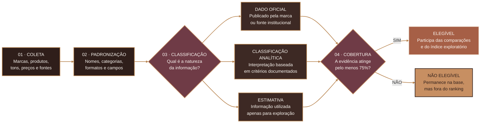

<br>

### Sistema de classificação das evidências

| CLASSIFICAÇÃO | DEFINIÇÃO | UTILIZAÇÃO NO PROJETO |
|:--|:--|:--|
| **Dado oficial** | Informação publicada diretamente pela marca ou por uma fonte institucional. | Utilizado como principal referência nas comparações e indicadores. |
| **Classificação analítica** | Interpretação baseada na descrição, organização ou sequência da cartela. | Utilizada quando existe um método definido e documentado para a análise. |
| **Estimativa** | Informação aproximada utilizada somente para fins exploratórios. | Mantida separada dos dados confirmados e não apresentada como fato oficial. |

<br>

<div align="center">

### Explore os três níveis de evidência

<sub>
Cada tipo de informação possui uma função diferente dentro da análise<br>
e precisa ser apresentado com o nível correto de confiança.
</sub>

</div>

<br>

<details open>

<summary><strong>01 · DADO OFICIAL</strong></summary>

<br>

**Origem**

Informação publicada diretamente pela marca, pelo fabricante ou por uma fonte institucional.

**Exemplos**

- quantidade de tonalidades anunciada;
- nome oficial do produto;
- preço apresentado no site;
- descrição de subtom publicada pela marca;
- disponibilidade observada na página oficial.

**Uso na análise**

Pode sustentar comparações, indicadores e conclusões, desde que a fonte e a data de acesso estejam registradas.

**Nível de confiança**

> Evidência prioritária do projeto.

<br>

</details>

<br>

<details>

<summary><strong>02 · CLASSIFICAÇÃO ANALÍTICA</strong></summary>

<br>

**Origem**

Interpretação construída durante a análise, utilizando critérios previamente definidos.

**Exemplos**

- agrupamento das tonalidades por profundidade;
- identificação de famílias de subtom;
- classificação de tons escuros, profundos ou retintos;
- organização de produtos em categorias comparáveis.

**Uso na análise**

Pode participar das comparações quando o critério utilizado estiver documentado e aplicado de maneira consistente.

**Nível de confiança**

> Interpretação verificável, mas diferente de uma declaração oficial da marca.

<br>

</details>

<br>

<details>

<summary><strong>03 · ESTIMATIVA</strong></summary>

<br>

**Origem**

Valor aproximado utilizado quando não existe confirmação suficiente na fonte consultada.

**Exemplos**

- quantidade estimada de tons profundos;
- possível família de subtom;
- classificação provisória de determinada tonalidade;
- aproximação utilizada durante a exploração inicial.

**Uso na análise**

Pode auxiliar na identificação de hipóteses e padrões, mas não deve ser apresentada como confirmação.

**Nível de confiança**

> Informação exploratória mantida separada dos dados oficiais.

<br>

</details>

<br>

### Regra de elegibilidade

| COBERTURA DE EVIDÊNCIAS | CLASSIFICAÇÃO | UTILIZAÇÃO |
|:--:|:--:|:--|
| **75% ou mais** | Elegível | Pode participar das comparações e do índice exploratório. |
| **Abaixo de 75%** | Não elegível | Permanece documentado, mas não participa do ranking. |

<br>

> **Por que 75%?**  
> A regra reduz o risco de comparar produtos apoiados por informações incompletas. Um produto pode continuar presente na base, mas somente entra nos rankings quando possui evidências suficientes para sustentar a análise.

<br>

### Controle de objetividade

| PERGUNTA DE CONTROLE | O QUE PRECISA SER REGISTRADO |
|:--|:--|
| **De onde veio a informação?** | Fonte principal e endereço consultado. |
| **Quando foi observada?** | Data de acesso ou coleta. |
| **A informação é oficial?** | Classificação entre dado oficial, análise ou estimativa. |
| **Qual método foi utilizado?** | Critério de tratamento ou classificação. |
| **A evidência está completa?** | Percentual de cobertura das informações necessárias. |
| **Qual é o nível de confiança?** | Situação de validação do registro. |
| **O produto pode ser comparado?** | Aplicação da regra mínima de 75%. |

<br>

### Camadas de proteção da análise

| RASTREABILIDADE | CONSISTÊNCIA | TRANSPARÊNCIA | ELEGIBILIDADE |
|:--:|:--:|:--:|:--:|
| Fonte e data registradas | Critérios iguais entre produtos | Estimativas separadas dos fatos | Cobertura mínima definida |
| Informações verificáveis | Campos padronizados | Limitações documentadas | Ranking com dados suficientes |
| Histórico preservado | Métodos reproduzíveis | Confiança comunicada | Comparações mais responsáveis |

<br>

### Protocolo de validação

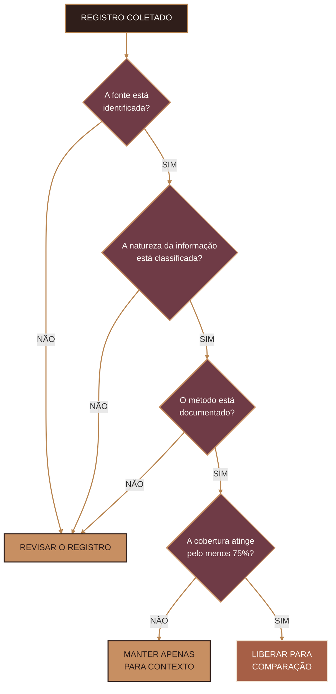

<br>

### Objetividade na prática

| O PROJETO EVITA | O PROJETO ADOTA |
|:--|:--|
| Apresentar estimativas como fatos confirmados. | Separação clara entre oficial, analítico e estimado. |
| Comparar produtos com informações insuficientes. | Regra mínima de cobertura de evidências. |
| Utilizar critérios diferentes entre marcas. | Padronização dos métodos de classificação. |
| Esconder limitações ou campos ausentes. | Registro transparente das restrições da análise. |
| Construir conclusões apenas pela quantidade de tons. | Análise conjunta de profundidade, subtom, preço, disponibilidade e evidência. |

<br>

### Resultado do protocolo

| DADO CONFIÁVEL | ANÁLISE RESPONSÁVEL | COMUNICAÇÃO TRANSPARENTE |
|:--:|:--:|:--:|
| Fonte identificada | Critérios documentados | Limitações apresentadas |
| Informação classificada | Comparações consistentes | Estimativas sinalizadas |
| Cobertura verificada | Indicadores reproduzíveis | Conclusões contextualizadas |

<br>

> **Compromisso de qualidade:** o objetivo da metodologia não é eliminar todas as limitações, mas torná-las visíveis, controladas e consideradas durante a interpretação dos resultados.

<br>

---

<br>

<br>

---

<br>

## 08 — ÍNDICE EXPLORATÓRIO DA ANÁLISE

<h3 align="center">Beauty Scorecard — inclusão traduzida em 100 pontos</h3>

<p align="center">
  <sub>
    Um modelo exploratório para reunir diferentes dimensões da inclusão<br>
    em uma leitura comparativa, transparente e orientada por evidências.
  </sub>
</p>

<br>

> **O QUE É O ÍNDICE?**  
> Uma ferramenta analítica que combina diversidade da cartela, presença de tons profundos, variedade de subtons, acessibilidade de preço e posicionamento inclusivo em uma pontuação máxima de **100 pontos**.

<br>

### Composição visual do índice

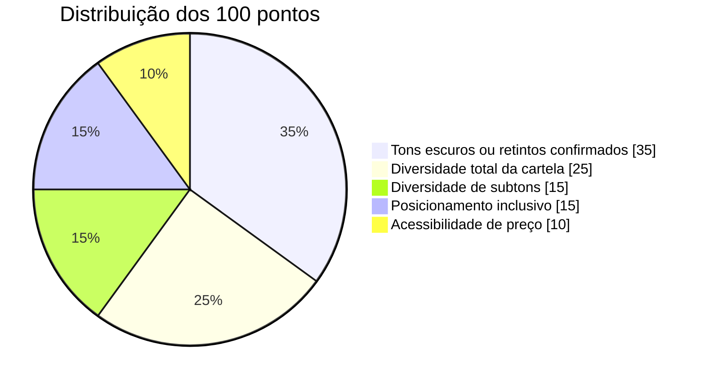

<br>

### Cartela de pesos

| DIMENSÃO ANALÍTICA | PESO MÁXIMO | PARTICIPAÇÃO NO ÍNDICE |
|:--|--:|:--:|
| **Tons escuros ou retintos confirmados** | **35 pontos** | 35% |
| **Diversidade total da cartela** | **25 pontos** | 25% |
| **Diversidade de subtons** | **15 pontos** | 15% |
| **Posicionamento inclusivo** | **15 pontos** | 15% |
| **Acessibilidade de preço** | **10 pontos** | 10% |
| **Pontuação total** | **100 pontos** | **100%** |

<br>

### Anatomia do score

```text
BEAUTY SCORECARD — 100 PONTOS
│
├── 35 pontos · Tons escuros ou retintos confirmados
├── 25 pontos · Diversidade total da cartela
├── 15 pontos · Diversidade de subtons
├── 15 pontos · Posicionamento inclusivo
└── 10 pontos · Acessibilidade de preço
```

<br>

### O que cada dimensão busca revelar

| DIMENSÃO | PERGUNTA ANALÍTICA | O QUE CONTRIBUI PARA A PONTUAÇÃO |
|:--|:--|:--|
| **Diversidade total da cartela** | O produto oferece uma quantidade ampla de tonalidades? | A variedade total disponível dentro da linha analisada. |
| **Tons escuros ou retintos confirmados** | A cartela contempla peles de maior profundidade? | A presença confirmada de tons escuros, profundos e retintos. |
| **Diversidade de subtons** | Existem opções para diferentes características de pele? | A variedade entre famílias quentes, frias, neutras e oliva. |
| **Acessibilidade de preço** | A inclusão também está associada à possibilidade de compra? | O posicionamento de preço observado entre produtos e marcas. |
| **Posicionamento inclusivo** | A marca apresenta ações e comunicação relacionadas à inclusão? | O compromisso inclusivo identificado no posicionamento analisado. |

<br>

### Por que os pesos são diferentes?

| PRIORIDADE | INTERPRETAÇÃO |
|:--|:--|
| **35 pontos — Profundidade** | Recebe o maior peso porque a presença de tons escuros e retintos está diretamente relacionada ao problema central investigado. |
| **25 pontos — Amplitude** | Uma cartela ampla aumenta as possibilidades de atendimento, mas precisa ser analisada junto à distribuição das tonalidades. |
| **15 pontos — Subtons** | A profundidade correta não garante compatibilidade quando existe pouca variedade de temperaturas e famílias de subtom. |
| **15 pontos — Posicionamento** | A comunicação inclusiva contribui para a proposta da marca, mas precisa estar acompanhada de evidências no portfólio. |
| **10 pontos — Preço** | O acesso financeiro complementa a análise, relacionando diversidade com possibilidade real de compra. |

<br>

### Fórmula conceitual

```text
ÍNDICE EXPLORATÓRIO
=
DIVERSIDADE DA CARTELA
+
TONS ESCUROS OU RETINTOS
+
DIVERSIDADE DE SUBTONS
+
ACESSIBILIDADE DE PREÇO
+
POSICIONAMENTO INCLUSIVO
```

<br>

### Fluxo de cálculo

| ETAPA | PROCESSO | RESULTADO |
|:--:|:--|:--|
| **01** | Verificar a cobertura de evidências do produto. | Confirmação da elegibilidade para o índice. |
| **02** | Avaliar individualmente as cinco dimensões. | Pontuação parcial para cada critério. |
| **03** | Aplicar os pesos máximos definidos. | Padronização da avaliação em até 100 pontos. |
| **04** | Somar as pontuações obtidas. | Score exploratório final do produto. |
| **05** | Interpretar o resultado junto aos dados originais. | Comparação contextualizada entre produtos e marcas. |

<br>

### Regras para utilização

| O ÍNDICE PODE | O ÍNDICE NÃO PODE |
|:--|:--|
| Apoiar comparações entre produtos elegíveis. | Ser apresentado como certificação oficial. |
| Reunir diferentes dimensões em uma leitura comum. | Substituir uma auditoria completa de mercado. |
| Destacar padrões e possíveis lacunas de inclusão. | Determinar sozinho se uma marca é inclusiva ou não. |
| Orientar investigações no Python e no Power BI. | Apagar limitações, ausências ou incertezas dos dados. |
| Apoiar recomendações estratégicas para a Aurena. | Ser interpretado sem consultar os critérios utilizados. |

<br>

### Elegibilidade antes da pontuação

> Um produto somente participa do índice quando possui pelo menos **75% de cobertura de evidências**. Produtos abaixo desse limite permanecem documentados na base, mas não entram no ranking comparativo.

<br>

### Leitura responsável do resultado

| COMPARAR | INVESTIGAR | CONTEXTUALIZAR |
|:--:|:--:|:--:|
| Produtos avaliados com os mesmos critérios | Motivos que aumentaram ou reduziram o score | Limitações, fontes e período da coleta |
| Dimensões com pesos previamente definidos | Lacunas em profundidade, subtom ou acesso | Diferenças entre dado oficial e classificação analítica |
| Pontuações apoiadas por evidências suficientes | Oportunidades para aprimorar a oferta | Realidade específica de cada produto e marca |

<br>

> **Importante:** uma pontuação maior indica melhor desempenho dentro dos critérios definidos pelo projeto, mas não representa um selo, certificação ou julgamento definitivo sobre uma marca.

<br>

### Papel do índice no projeto

| PYTHON | POWER BI | STORYTELLING |
|:--:|:--:|:--:|
| Cálculo e validação das pontuações | Comparação visual entre marcas e produtos | Explicação dos padrões encontrados |
| Análise das dimensões separadamente | Filtros por score, marca e categoria | Conexão entre resultado e contexto |
| Verificação da cobertura de evidências | Destaque das maiores lacunas | Recomendações para a Aurena |

<br>

> **Leitura estratégica:** o valor do índice não está apenas no número final. O principal diferencial é permitir que cada dimensão seja analisada separadamente, revelando quais fatores fortalecem ou limitam a inclusão de cada produto.

<br>

---

<br>

<br>

---

<br>

## 09 — ARQUITETURA DOS DADOS

<h3 align="center">Necessaire Analítica — cada dado em sua camada</h3>

<p align="center">
  <sub>
    Assim como uma produção de maquiagem combina diferentes produtos e etapas,<br>
    a análise integra marcas, linhas, tonalidades e evidências em uma estrutura organizada.
  </sub>
</p>

<br>

> **CONCEITO DA ARQUITETURA**  
> Cada arquivo possui uma função específica dentro do projeto. Quando relacionados, eles permitem analisar o mercado de maquiagem desde a identidade das marcas até os detalhes de cada tonalidade.

<br>

### A necessaire de dados

| IDENTIDADE DA MARCA | PORTFÓLIO DE PRODUTOS | CARTELA DE TONS | SELO DE PROCEDÊNCIA |
|:--:|:--:|:--:|:--:|
| **`marcas.csv`** | **`linhas_produtos.csv`** | **`tons_detalhados.csv`** | **`fontes.csv`** |
| Cadastro e posicionamento | Informações das linhas analisadas | Detalhamento de cada tonalidade | Origem e validação das informações |
| Quem oferece? | O que é oferecido? | Para quais peles? | Como podemos comprovar? |

<br>

### Anatomia da base

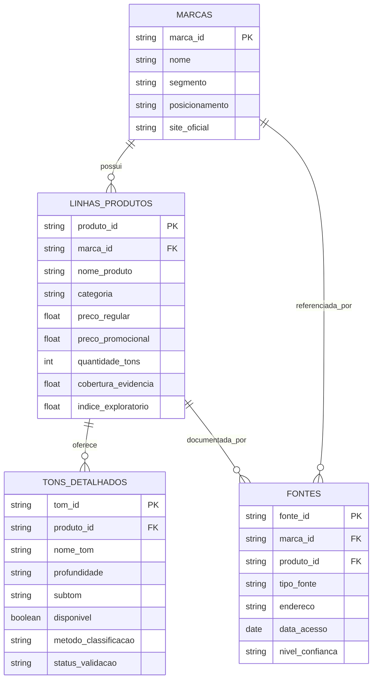

<br>

### Função de cada arquivo

| ARQUIVO | UNIDADE DE ANÁLISE | FINALIDADE |
|:--|:--|:--|
| **`marcas.csv`** | Uma linha por marca | Registrar nome, segmento, posicionamento e site oficial. |
| **`linhas_produtos.csv`** | Uma linha por produto | Comparar marcas, preços, quantidade de tons e indicadores. |
| **`tons_detalhados.csv`** | Uma linha por tonalidade | Analisar profundidade, subtom, disponibilidade e método de classificação. |
| **`fontes.csv`** | Uma linha por evidência | Auditar páginas, datas de acesso e informações confirmadas. |

<br>

### A lógica por trás da organização

| CAMADA | PERGUNTA RESPONDIDA | BASE UTILIZADA |
|:--|:--|:--|
| **Marca** | Quem participa do mercado analisado? | `marcas.csv` |
| **Produto** | Quais linhas e categorias são oferecidas? | `linhas_produtos.csv` |
| **Tonalidade** | Como os tons e subtons estão distribuídos? | `tons_detalhados.csv` |
| **Evidência** | Qual é a origem e a confiabilidade da informação? | `fontes.csv` |

<br>

### Rotina de construção dos dados

| 01 — PREPARAÇÃO | 02 — COBERTURA | 03 — ACABAMENTO |
|:--:|:--:|:--:|
| Cadastro das marcas e registro das fontes | Integração das linhas de produtos e tonalidades | Criação de indicadores, visualizações e insights |
| Identidade e procedência | Portfólio, profundidade e subtom | Python, Power BI e storytelling |
| Base rastreável | Base comparável | Resultado estratégico |

<br>

### Do registro ao insight

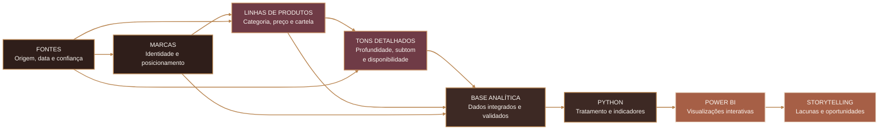

<br>

### Organização dos campos

| IDENTIFICAÇÃO | COR E REPRESENTATIVIDADE | ACESSO | EVIDÊNCIA |
|:--|:--|:--|:--|
| Marca | Nome da tonalidade | Preço regular | Fonte principal |
| Produto | Profundidade | Preço promocional | Data de acesso |
| Categoria | Família de subtom | Disponibilidade | Status de validação |
| Segmento | Tons profundos confirmados | Estoque observado | Nível de confiança |
| Posicionamento | Método de classificação | Condição de compra | Cobertura de evidência |

<br>

<details open>

<summary><strong>01 · IDENTIDADE E PORTFÓLIO</strong></summary>

<br>

Campos utilizados para identificar as marcas e organizar os produtos:

- marca;
- nome do produto;
- categoria;
- segmento;
- posicionamento;
- site oficial;
- quantidade total de tonalidades.

Essas informações permitem comparar empresas e produtos sem perder a relação entre cada linha e sua respectiva marca.

<br>

</details>

<br>

<details>

<summary><strong>02 · CARTELA DE TONS</strong></summary>

<br>

Campos utilizados para analisar a diversidade das tonalidades:

- nome da tonalidade;
- profundidade;
- família de subtom;
- temperatura do subtom;
- tons escuros ou retintos confirmados;
- tons estimados;
- método de classificação.

As estimativas permanecem separadas das informações oficiais para preservar a transparência da análise.

<br>

</details>

<br>

<details>

<summary><strong>03 · PREÇO E DISPONIBILIDADE</strong></summary>

<br>

Campos utilizados para investigar acesso e possibilidade real de compra:

- preço regular;
- preço promocional;
- disponibilidade observada;
- data da observação;
- situação do estoque;
- categoria do produto.

Esses dados ajudam a verificar se a diversidade anunciada também estava disponível ao consumidor.

<br>

</details>

<br>

<details>

<summary><strong>04 · QUALIDADE DAS EVIDÊNCIAS</strong></summary>

<br>

Campos utilizados para controlar a confiabilidade das informações:

- fonte principal;
- tipo da fonte;
- data de acesso;
- status de validação;
- nível de confiança;
- cobertura de evidência;
- classificação entre oficial, analítico ou estimado.

A cobertura de evidência determina se o produto está apto a participar das comparações e do índice exploratório.

<br>

</details>

<br>

### Relacionamento entre as bases

| RELAÇÃO | CHAVE DE CONEXÃO | RESULTADO |
|:--|:--|:--|
| Marca → Produto | Identificador da marca | Permite saber quais linhas pertencem a cada empresa. |
| Produto → Tonalidade | Identificador do produto | Conecta cada tom à sua respectiva cartela. |
| Produto → Fonte | Identificador do produto | Associa as informações utilizadas às evidências consultadas. |
| Marca → Fonte | Identificador da marca | Registra páginas institucionais e posicionamentos oficiais. |

<br>

### Regras de integridade

| REGRA | OBJETIVO |
|:--|:--|
| Cada marca possui um identificador único. | Evitar registros duplicados e variações de nomes. |
| Cada produto pertence a uma marca cadastrada. | Preservar a relação entre empresa e portfólio. |
| Cada tonalidade pertence a um produto identificado. | Evitar tons desconectados de suas respectivas linhas. |
| Cada evidência possui fonte e data de acesso. | Garantir rastreabilidade das informações. |
| Dados oficiais e estimativas permanecem separados. | Evitar que interpretações sejam apresentadas como fatos. |
| Campos ausentes não são preenchidos sem evidência. | Preservar a objetividade da base. |

<br>

### Da base bruta à base analítica

```text
COLETA ORIGINAL
      │
      ├── marcas
      ├── produtos
      ├── tonalidades
      └── fontes
             │
             ▼
      LIMPEZA E PADRONIZAÇÃO
             │
             ├── nomes padronizados
             ├── preços convertidos
             ├── categorias organizadas
             └── ausências identificadas
             │
             ▼
       VALIDAÇÃO DAS EVIDÊNCIAS
             │
             ├── dado oficial
             ├── classificação analítica
             └── estimativa
             │
             ▼
         BASE ANALÍTICA
             │
             ├── indicadores
             ├── índice exploratório
             ├── gráficos
             └── dashboard
```

<br>

### Resultado da arquitetura

| ORGANIZAÇÃO | RASTREABILIDADE | ESCALABILIDADE |
|:--:|:--:|:--:|
| Cada informação ocupa uma base específica | Fontes e datas permanecem associadas aos dados | Novas marcas e produtos podem ser adicionados |
| Relações entre marca, produto e tom são preservadas | Classificações e estimativas são identificadas | A estrutura pode alimentar Python, Power BI e aplicações |
| Campos seguem critérios padronizados | Informações podem ser conferidas e revisadas | Novos indicadores podem ser incorporados futuramente |

<br>

> **Leitura estratégica:** uma arquitetura bem organizada permite enxergar a cartela completa sem perder os detalhes de cada tonalidade. Assim como em uma produção de maquiagem, cada camada possui uma função — e o resultado depende da integração entre todas elas.

<br>

---

<br>

## 10 — FLUXO DE DESENVOLVIMENTO

<div align="center">

### Da coleta à decisão

<sub>
Um processo estruturado para transformar informações sobre maquiagem  
em evidências, indicadores e decisões estratégicas.
</sub>

</div>

<br>

```mermaid
flowchart LR
    A["01 · COLETA<br/>Fontes e produtos"] --> B["02 · TRATAMENTO<br/>Limpeza e padronização"]
    B --> C["03 · VALIDAÇÃO<br/>Controle das evidências"]
    C --> D["04 · ANÁLISE<br/>Indicadores e lacunas"]
    D --> E["05 · POWER BI<br/>Dashboard executivo"]
    E --> F["06 · STORYTELLING<br/>Narrativa de impacto"]
    F --> G["07 · ENTREGA<br/>Apresentação final"]

    classDef dados fill:#2F1E1A,stroke:#B8844F,color:#FCF8F3,stroke-width:2px;
    classDef inteligencia fill:#6F3B46,stroke:#C78F62,color:#FCF8F3,stroke-width:2px;
    classDef comunicacao fill:#A65F46,stroke:#F3E7D8,color:#FCF8F3,stroke-width:2px;

    class A,B,C dados;
    class D,E inteligencia;
    class F,G comunicacao;

    linkStyle default stroke:#B8844F,stroke-width:2px;
```

<br>

### Entregas de cada etapa

| ETAPA | PROCESSO | ENTREGA |
|:--|:--|:--|
| **01 — Coleta** | Pesquisa de marcas, produtos, preços, tonalidades e fontes oficiais. | Base bruta com informações rastreáveis. |
| **02 — Tratamento** | Limpeza, correção de inconsistências e padronização dos campos. | Base processada e pronta para análise. |
| **03 — Validação** | Separação entre dados oficiais, classificações analíticas e estimativas. | Dados classificados por nível de confiança. |
| **04 — Análise** | Comparação de tons, subtons, preços, disponibilidade e evidências. | Indicadores e identificação das principais lacunas. |
| **05 — Power BI** | Modelagem, criação de medidas, filtros e visualizações. | Dashboard executivo e interativo. |
| **06 — Storytelling** | Organização dos resultados em uma narrativa orientada por dados. | História conectando problema, evidência e oportunidade. |
| **07 — Entrega** | Revisão técnica, validação visual e preparação da apresentação. | Projeto final documentado e pronto para apresentação. |

<br>

### Status atual do pipeline

<table>
  <tr>
    <td align="center" width="33%">
      <strong>CONCLUÍDO</strong>
      <br><br>
      Definição do recorte
      <br>
      Estrutura inicial das bases
      <br>
      Coleta principal
    </td>
    <td align="center" width="34%">
      <strong>EM DESENVOLVIMENTO</strong>
      <br><br>
      Tratamento e validação
      <br>
      Análise exploratória
      <br>
      Power BI e storytelling
    </td>
    <td align="center" width="33%">
      <strong>PRÓXIMA ENTREGA</strong>
      <br><br>
      Revisão das evidências
      <br>
      Validação do dashboard
      <br>
      Preparação da apresentação
    </td>
  </tr>
</table>

<br>

> **Controle de qualidade:** cada etapa precisa gerar uma entrega verificável antes do avanço para a próxima fase. Estimativas são mantidas separadas dos dados confirmados e todas as informações utilizadas devem possuir fonte registrada.

<br>

<br>

## 11 — EXPERIÊNCIA DO DASHBOARD

O dashboard foi planejado para conduzir a apresentação como uma narrativa, e não como um conjunto isolado de gráficos.

<table>
  <tr>
    <th>PÁGINA</th>
    <th>OBJETIVO</th>
    <th>PERGUNTA RESPONDIDA</th>
  </tr>
  <tr>
    <td><strong>Visão do mercado</strong></td>
    <td>Apresentar tamanho e distribuição da base.</td>
    <td>Quais marcas e linhas possuem maior variedade?</td>
  </tr>
  <tr>
    <td><strong>Profundidade e subtom</strong></td>
    <td>Investigar inclusão além da contagem total.</td>
    <td>Os tons profundos e seus subtons estão representados?</td>
  </tr>
  <tr>
    <td><strong>Preço e acesso</strong></td>
    <td>Relacionar diversidade com possibilidade de compra.</td>
    <td>A inclusão também é acessível e disponível?</td>
  </tr>
  <tr>
    <td><strong>Oportunidade Aurena</strong></td>
    <td>Transformar lacunas em recomendação de negócio.</td>
    <td>Onde a nova marca pode gerar valor real?</td>
  </tr>
</table>

<br>

<br>

## 12 — TECNOLOGIAS

<div align="center">


</div>

<br>

<br>

---

<br>

## 13 — EQUIPE E RESPONSABILIDADES

<div align="center">

### Uma equipe, três frentes, um mesmo objetivo

<sub>
Dados, visualização e storytelling trabalhando de forma integrada  
para transformar diversidade em análise, estratégia e impacto.
</sub>

</div>

<br>

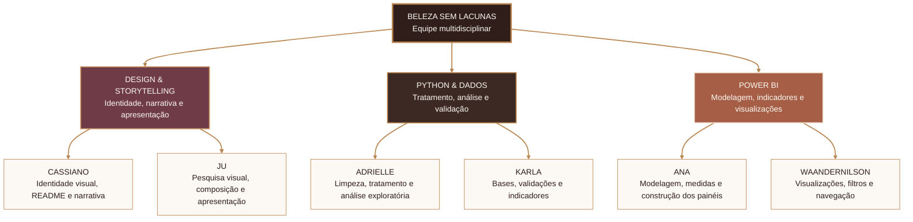

<br>

### Frentes de atuação

| FRENTE | RESPONSÁVEIS | FOCO PRINCIPAL | ENTREGA |
|:--|:--|:--|:--|
| **Design & Storytelling** | Cassiano e Ju | Identidade visual, experiência do projeto, narrativa e apresentação. | README, materiais visuais, storytelling e apresentação final. |
| **Python & Dados** | Adrielle e Karla | Limpeza, tratamento, padronização, validação e análise exploratória. | Bases processadas, indicadores, notebooks e documentação técnica. |
| **Power BI** | Ana e Waandernilson | Modelagem, medidas, visualizações, filtros e navegação. | Dashboard executivo, páginas analíticas e experiência interativa. |

<br>

### Responsabilidades individuais

<table>
  <tr>
    <th align="left" width="18%">INTEGRANTE</th>
    <th align="left" width="22%">ÁREA</th>
    <th align="left" width="60%">RESPONSABILIDADES</th>
  </tr>

  <tr>
    <td valign="top">
      <strong>Cassiano</strong>
    </td>
    <td valign="top">
      Design e storytelling
    </td>
    <td valign="top">
      Direção visual da Aurena, organização do README, construção da narrativa,
      integração entre dados e identidade e preparação da apresentação final.
    </td>
  </tr>

  <tr>
    <td valign="top">
      <strong>Ju</strong>
    </td>
    <td valign="top">
      Design e storytelling
    </td>
    <td valign="top">
      Pesquisa de referências, composição visual, apoio às peças gráficas,
      desenvolvimento da apresentação e revisão da comunicação do projeto.
    </td>
  </tr>

  <tr>
    <td valign="top">
      <strong>Adrielle</strong>
    </td>
    <td valign="top">
      Python e dados
    </td>
    <td valign="top">
      Limpeza dos dados, tratamento de valores ausentes, padronização de campos,
      análise exploratória e apoio à construção dos indicadores.
    </td>
  </tr>

  <tr>
    <td valign="top">
      <strong>Karla</strong>
    </td>
    <td valign="top">
      Python e dados
    </td>
    <td valign="top">
      Organização das bases, validação das informações, desenvolvimento dos
      indicadores, controle das evidências e documentação técnica.
    </td>
  </tr>

  <tr>
    <td valign="top">
      <strong>Ana</strong>
    </td>
    <td valign="top">
      Power BI
    </td>
    <td valign="top">
      Modelagem dos dados, construção de medidas, criação das páginas do dashboard
      e organização visual dos principais indicadores.
    </td>
  </tr>

  <tr>
    <td valign="top">
      <strong>Waandernilson</strong>
    </td>
    <td valign="top">
      Power BI
    </td>
    <td valign="top">
      Desenvolvimento das visualizações, configuração de filtros, navegação entre
      páginas, testes de interação e validação do dashboard.
    </td>
  </tr>
</table>

<br>

### Como as frentes se conectam

| ETAPA | DESIGN & STORYTELLING | PYTHON & DADOS | POWER BI |
|:--|:--|:--|:--|
| **Planejamento** | Define a linguagem visual e a narrativa. | Estrutura as perguntas e os campos necessários. | Planeja indicadores e páginas do dashboard. |
| **Desenvolvimento** | Organiza a comunicação dos resultados. | Trata, valida e analisa os dados. | Modela os dados e constrói as visualizações. |
| **Validação** | Revisa clareza, coerência e apresentação. | Confere cálculos, fontes e consistência. | Testa medidas, filtros e interações. |
| **Entrega** | Conduz o storytelling e a apresentação. | Explica metodologia, análises e limitações. | Apresenta indicadores, gráficos e insights. |

<br>

> **Modelo de trabalho:** apesar da divisão por frentes, as decisões são compartilhadas. Cada entrega passa por revisão técnica, visual e narrativa antes de ser incorporada à versão final do projeto.

<br>

### Organização da equipe

| DADOS CONFIÁVEIS | VISUALIZAÇÃO CLARA | NARRATIVA DE IMPACTO |
|:--:|:--:|:--:|
| Coleta rastreável | Indicadores objetivos | Problema bem definido |
| Tratamento documentado | Navegação intuitiva | Insights contextualizados |
| Validação das evidências | Dashboard consistente | Apresentação estratégica |

<br>

## 14 — STATUS E ROADMAP

<div align="center">

### Do desenvolvimento à apresentação final

<sub>
Acompanhamento das entregas, prioridades e próximas etapas  
do projeto Beleza sem Lacunas.
</sub>

</div>

<br>

> **STATUS ATUAL — EM DESENVOLVIMENTO**  
> O projeto está na fase de tratamento, análise, construção do dashboard e organização do storytelling.

<br>

### Visão geral do projeto

| INFORMAÇÃO | DEFINIÇÃO |
|:--|:--|
| **Situação atual** | Em desenvolvimento |
| **Prazo interno** | 16 de agosto de 2026 |
| **Apresentação final** | 18 de agosto de 2026 |
| **Fase atual** | Tratamento, análise e construção das visualizações |
| **Próxima prioridade** | Validar indicadores e concluir o dashboard |
| **Objetivo da entrega** | Apresentar uma análise clara, rastreável e visualmente profissional |

<br>

### Progresso das entregas

| ETAPA | STATUS | RESULTADO |
|:--|:--:|:--|
| Definição do problema e recorte | **CONCLUÍDO** | Tema, público e perguntas de negócio definidos. |
| Identidade visual da Aurena | **CONCLUÍDO** | Conceito, paleta, logo e direção editorial estabelecidos. |
| Estrutura inicial das bases | **CONCLUÍDO** | Arquivos organizados em dados brutos e processados. |
| Coleta e registro das fontes | **EM REVISÃO** | Marcas, produtos, tonalidades, preços e fontes catalogados. |
| Limpeza e padronização em Python | **EM ANDAMENTO** | Tratamento de campos, valores ausentes e inconsistências. |
| Análise exploratória | **EM ANDAMENTO** | Comparações, indicadores e identificação de lacunas. |
| Dashboard no Power BI | **EM ANDAMENTO** | Construção das páginas, filtros, medidas e gráficos. |
| Storytelling e apresentação | **EM ANDAMENTO** | Organização da narrativa e dos principais insights. |
| Validação técnica e visual | **PRÓXIMA ETAPA** | Revisão dos dados, cálculos, textos e identidade visual. |
| Ensaio da apresentação | **PENDENTE** | Divisão das falas, teste de tempo e preparação para perguntas. |

<br>

### Roadmap visual

```mermaid
flowchart LR
    A["01 · PLANEJAMENTO<br/>Problema e objetivos"] --> B["02 · COLETA<br/>Marcas, produtos e fontes"]
    B --> C["03 · TRATAMENTO<br/>Limpeza e padronização"]
    C --> D["04 · ANÁLISE<br/>Indicadores e lacunas"]
    D --> E["05 · DASHBOARD<br/>Power BI"]
    E --> F["06 · STORYTELLING<br/>Narrativa e insights"]
    F --> G["07 · VALIDAÇÃO<br/>Revisão final"]
    G --> H["08 · APRESENTAÇÃO<br/>Entrega do projeto"]

    classDef concluido fill:#2F1E1A,stroke:#B8844F,color:#FCF8F3,stroke-width:2px;
    classDef andamento fill:#6F3B46,stroke:#C78F62,color:#FCF8F3,stroke-width:2px;
    classDef proximo fill:#A65F46,stroke:#F3E7D8,color:#FCF8F3,stroke-width:2px;

    class A,B concluido;
    class C,D,E,F andamento;
    class G,H proximo;

    linkStyle default stroke:#B8844F,stroke-width:2px;
```

<br>

### Cronograma de finalização

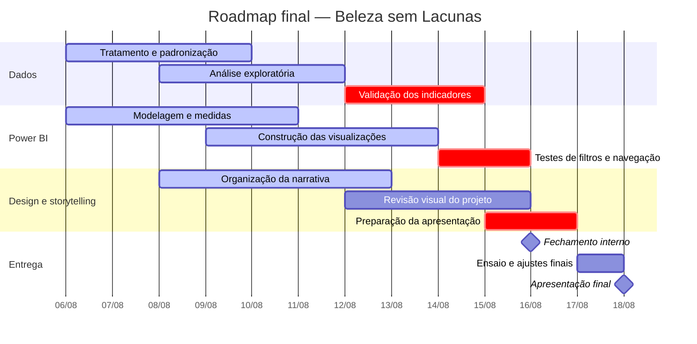

<br>

### Prioridades da fase atual

| PRIORIDADE | RESPONSÁVEIS | CRITÉRIO DE CONCLUSÃO |
|:--|:--|:--|
| **Tratamento dos dados** | Python e Dados | Bases limpas, padronizadas e documentadas. |
| **Validação das evidências** | Python e Dados | Informações oficiais separadas de estimativas. |
| **Construção do dashboard** | Power BI | Páginas, medidas, filtros e navegação funcionando. |
| **Organização do storytelling** | Design e Storytelling | Narrativa conectando problema, dados e oportunidade. |
| **Revisão integrada** | Toda a equipe | Coerência entre base, gráficos, textos e apresentação. |

<br>

### Critérios para considerar o projeto concluído

| DADOS | DASHBOARD | APRESENTAÇÃO |
|:--:|:--:|:--:|
| Bases tratadas | Medidas validadas | Storytelling estruturado |
| Fontes registradas | Filtros funcionando | Falas divididas |
| Indicadores conferidos | Navegação testada | Tempo ensaiado |
| Limitações documentadas | Visual consistente | Perguntas revisadas |

<br>

> **Regra de qualidade:** nenhuma entrega será considerada finalizada apenas por estar visualmente pronta. Os dados, os cálculos, as fontes e a narrativa precisam estar coerentes entre si.

<br>

## 15 — ESTRUTURA DO REPOSITÓRIO

<h3 align="center">Organização técnica do projeto</h3>

<p align="center">
  <sub>
    Uma estrutura modular para separar dados brutos, tratamentos, análises,<br>
    visualizações e documentação.
  </sub>
</p>

<br>

```text
shade_equity_analytics_starter/
├── app/
│   └── .gitkeep
│
├── assets/
│   ├── aurena-logo.png
│   ├── hero-beleza-sem-lacunas.png
│   └── demais-elementos-visuais/
│
├── data/
│   ├── raw/
│   │   ├── thepudding_allNumbers.csv
│   │   ├── thepudding_allShades.csv
│   │   └── demais-bases-originais/
│   │
│   └── processed/
│       ├── base_maquiagem_unificada.csv
│       └── demais-bases-tratadas/
│
├── notebooks/
│   ├── 01_exploracao_inicial.ipynb
│   └── analise.ipynb
│
├── reports/
│   └── figures/
│       └── graficos-exportados/
│
├── src/
│   └── scripts-python/
│
├── .gitignore
├── README.md
└── requirements.txt
```

<br>

### Arquitetura visual

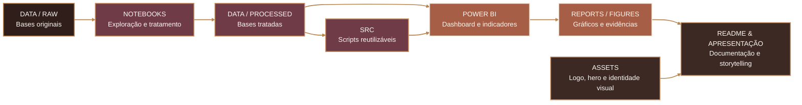

<br>

### Função de cada diretório

| DIRETÓRIO | CONTEÚDO | FINALIDADE |
|:--|:--|:--|
| **`app/`** | Arquivos relacionados a uma futura aplicação ou interface do projeto. | Reservar a estrutura necessária para disponibilizar os resultados em formato web. |
| **`assets/`** | Logo, hero, imagens, ícones e elementos da identidade Aurena. | Armazenar os recursos visuais utilizados no README e na apresentação. |
| **`data/raw/`** | Bases originais, sem alterações. | Preservar os dados exatamente como foram coletados. |
| **`data/processed/`** | Bases limpas, padronizadas e integradas. | Disponibilizar os dados preparados para análise e visualização. |
| **`notebooks/`** | Arquivos Jupyter utilizados nas análises. | Documentar exploração, limpeza, transformação e criação de indicadores. |
| **`reports/figures/`** | Gráficos, imagens e resultados exportados. | Reunir evidências visuais produzidas durante as análises. |
| **`src/`** | Scripts Python reutilizáveis. | Separar funções e processos que não precisam permanecer dentro dos notebooks. |
| **`README.md`** | Documentação principal do projeto. | Apresentar problema, metodologia, resultados, equipe e roadmap. |
| **`requirements.txt`** | Bibliotecas utilizadas no ambiente Python. | Permitir a reprodução do projeto em outro computador. |
| **`.gitignore`** | Arquivos e pastas que não devem ser enviados ao GitHub. | Evitar o versionamento do ambiente virtual e de arquivos temporários. |

<br>

### Fluxo dos dados no repositório

| FASE | ENTRADA | PROCESSO | SAÍDA |
|:--|:--|:--|:--|
| **01 — Coleta** | Sites, catálogos e bases externas. | Registro das informações e das fontes. | Arquivos em `data/raw/`. |
| **02 — Exploração** | Bases originais. | Verificação de colunas, tipos, ausências e duplicidades. | Notebooks exploratórios. |
| **03 — Tratamento** | Dados brutos e inconsistências identificadas. | Limpeza, padronização e integração. | Arquivos em `data/processed/`. |
| **04 — Análise** | Bases tratadas. | Cálculo de indicadores e identificação de lacunas. | Tabelas, métricas e gráficos. |
| **05 — Visualização** | Indicadores validados. | Modelagem e desenvolvimento no Power BI. | Dashboard executivo. |
| **06 — Comunicação** | Resultados técnicos e visuais. | Organização da narrativa e documentação. | README e apresentação final. |

<br>

### Convenção dos notebooks

| PREFIXO | ETAPA |
|:--:|:--|
| `01_` | Exploração e compreensão inicial dos dados |
| `02_` | Limpeza e padronização |
| `03_` | Integração das bases |
| `04_` | Análise exploratória |
| `05_` | Indicadores e preparação para o Power BI |

**Exemplo de organização futura:**

```text
notebooks/
├── 01_exploracao_inicial.ipynb
├── 02_limpeza_padronizacao.ipynb
├── 03_integracao_das_bases.ipynb
├── 04_analise_exploratoria.ipynb
└── 05_indicadores_power_bi.ipynb
```

<br>

### Boas práticas adotadas

| PRÁTICA | APLICAÇÃO NO PROJETO |
|:--|:--|
| **Preservação dos dados originais** | Os arquivos em `data/raw/` não são sobrescritos. |
| **Separação por etapas** | Dados brutos, processados, códigos e imagens ficam em diretórios próprios. |
| **Notebooks numerados** | A ordem dos arquivos acompanha o fluxo da análise. |
| **Reprodutibilidade** | As bibliotecas necessárias são registradas em `requirements.txt`. |
| **Rastreabilidade** | Alterações importantes ficam documentadas nos notebooks e no GitHub. |
| **Versionamento** | O histórico do projeto é controlado com Git e GitHub. |
| **Documentação contínua** | O README acompanha a evolução das entregas. |

<br>

<h3 align="center">Arquivos que não devem ser enviados ao GitHub</h3>

<p align="center">
  O ambiente virtual <code>.venv</code> deve permanecer apenas no computador de cada integrante.<br>
  Inclua estas linhas no arquivo <code>.gitignore</code>:
</p>

<br>

```gitignore
# Ambiente virtual
.venv/
venv/

# Arquivos temporários do Python
__pycache__/
*.py[cod]

# Configurações locais do Jupyter
.ipynb_checkpoints/

# Arquivos do sistema
.DS_Store
Thumbs.db

# Configurações locais de editores
.vscode/
```

<br>

> **Importante:** o arquivo `requirements.txt` deve ser enviado ao GitHub, mas a pasta `.venv` não. O `requirements.txt` registra as bibliotecas utilizadas; a `.venv` contém uma instalação local que pode ser recriada.

<br>

### Princípio da arquitetura

> Cada arquivo deve possuir uma finalidade clara e ocupar apenas um lugar dentro do projeto. Essa organização reduz erros, facilita a colaboração entre a equipe e permite que qualquer pessoa compreenda o caminho entre o dado bruto e o resultado final.

<br>
<br>

---

<br>

## 16 — PRINCÍPIOS E LIMITAÇÕES

<div align="center">

### Transparência também faz parte do resultado

<sub>
Uma análise responsável precisa apresentar não apenas seus resultados,<br>
mas também os critérios, limites e cuidados utilizados na interpretação.
</sub>

</div>

<br>

> **COMPROMISSO METODOLÓGICO**  
> O projeto Beleza sem Lacunas busca transformar informações sobre maquiagem e representatividade em evidências rastreáveis, contextualizadas e úteis para decisões estratégicas.

<br>

### Princípios que orientam o projeto

| PRINCÍPIO | APLICAÇÃO NO PROJETO |
|:--|:--|
| **Rastreabilidade** | Toda informação utilizada deve estar vinculada a uma fonte identificável e à data em que foi consultada. |
| **Transparência** | Estimativas, classificações analíticas e dados oficiais são apresentados de maneira separada. |
| **Contexto** | A quantidade total de tonalidades não é analisada isoladamente, mas em conjunto com profundidade, subtom, preço e disponibilidade. |
| **Representatividade** | A avaliação considera a presença de tons escuros, profundos e retintos, além da diversidade de subtons. |
| **Aplicabilidade** | Os resultados devem apoiar decisões relacionadas a produto, posicionamento, estoque, preço e comunicação. |

<br>

### Caminho para uma análise responsável


<br>

### Limitações da análise

| LIMITAÇÃO | IMPACTO NA INTERPRETAÇÃO | CUIDADO ADOTADO |
|:--|:--|:--|
| **Recorte temporal** | Preços, promoções e disponibilidade podem mudar após a data da coleta. | As informações representam o cenário observado no período analisado. |
| **Índice exploratório** | O score não representa certificação, auditoria ou julgamento definitivo de uma marca. | O índice é utilizado somente como ferramenta comparativa e exploratória. |

<br>

### Como os resultados devem ser interpretados

| O PROJETO ANALISA | O PROJETO NÃO SUBSTITUI | USO RECOMENDADO |
|:--|:--|:--|
| Oferta de tons, profundidade, subtom, preço, disponibilidade e evidências. | Pesquisa direta com consumidores, auditoria de mercado ou certificação oficial. | Identificação de padrões, lacunas e oportunidades para decisões de negócio. |

<br>

### Critérios de responsabilidade

| DADOS | ANÁLISE | COMUNICAÇÃO |
|:--:|:--:|:--:|
| Fontes identificadas | Critérios documentados | Limitações apresentadas |
| Estimativas separadas | Comparações contextualizadas | Insights sem generalizações |
| Informações rastreáveis | Indicadores verificáveis | Narrativa baseada em evidências |

<br>

> **Leitura responsável:** os resultados devem ser compreendidos dentro do recorte, das fontes e dos critérios definidos neste projeto. Uma cartela numerosa não significa, por si só, que uma marca seja plenamente inclusiva.

<br>

### Compromisso final

| RASTREABILIDADE | REPRESENTATIVIDADE | IMPACTO |
|:--:|:--:|:--:|
| Dados com origem identificada | Diversidade analisada além da quantidade | Evidências transformadas em oportunidade |
| Métodos documentados | Profundidade e subtom considerados | Recomendações conectadas ao negócio |
| Limitações reconhecidas | Inclusão tratada com responsabilidade | Comunicação clara e estratégica |

<br>

---

<br>

<div align="center">

<br>

<div align="center">

### AURENA

**A nova geração da beleza começa em você.**

<sub>
Dados para enxergar lacunas. Estratégia para ampliar possibilidades.
</sub>

</div>

<br>

<p align="center">
  
</p>