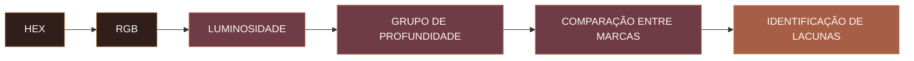
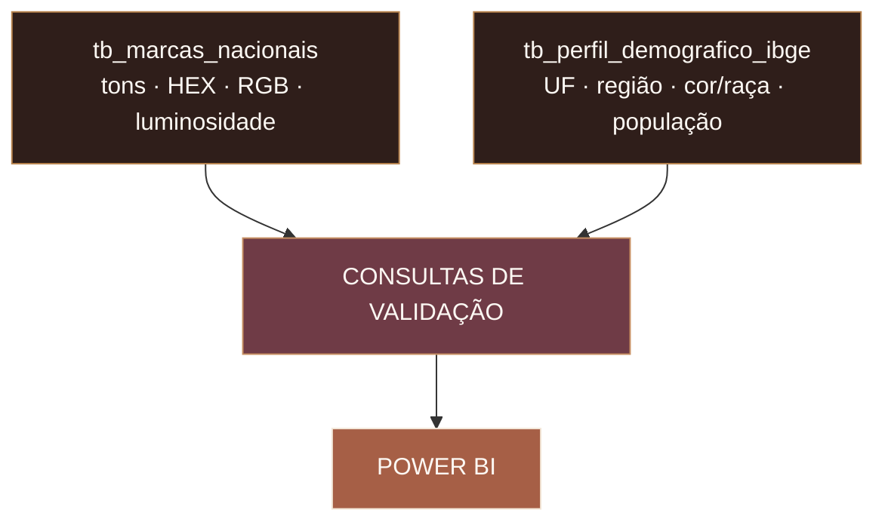
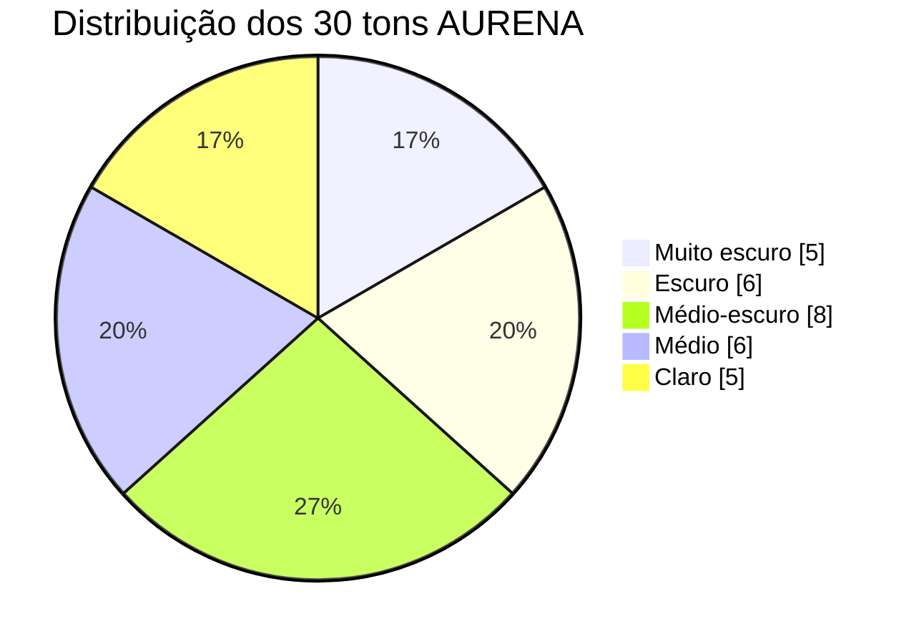

<div align="center">


<br>


<br>


<br>


<br><br>

**Dados que enxergam pessoas. Beleza que amplia possibilidades.**

</div>

---

## 01 — VISÃO GERAL

A **AURENA** é o projeto final do Bootcamp de **Análise de Dados da Generation**, desenvolvido para investigar se a oferta de tons de maquiagem acompanha a diversidade das peles brasileiras.

> ### Pergunta norteadora
> **Quantos tons são suficientes para representar o Brasil?**

O trabalho conecta **pesquisa, ETL, análise exploratória, SQL, Power BI, design e desenvolvimento front-end** para transformar dados em uma narrativa sobre representatividade e, a partir das lacunas encontradas, apresentar uma proposta de **30 tons AURENA**.

<div align="center">


</div>

---

## 02 — ARQUITETURA DO PROJETO

```mermaid
flowchart LR
    A["PESQUISA<br/>The Pudding · IBGE · marcas nacionais"]
    B["TRATAMENTO<br/>Python · Pandas · Excel"]
    C["BANCO<br/>SQL · validações"]
    D["ANÁLISE<br/>comparações · luminosidade · inclusão"]
    E["POWER BI<br/>modelo · medidas · filtros · 5 páginas"]
    F["SITE AURENA<br/>HTML · CSS · JavaScript"]
    G["STORYTELLING<br/>lacuna → possibilidade"]

    A --> B --> C --> D --> E --> F --> G

    classDef origem fill:#2F1E1A,stroke:#B8844F,color:#FCF8F3,stroke-width:2px;
    classDef dados fill:#6F3B46,stroke:#C78F62,color:#FCF8F3,stroke-width:2px;
    classDef analise fill:#3D2924,stroke:#B8844F,color:#FCF8F3,stroke-width:2px;
    classDef entrega fill:#A65F46,stroke:#F3E7D8,color:#FCF8F3,stroke-width:2px;

    class A origem;
    class B,C dados;
    class D,E analise;
    class F,G entrega;

    linkStyle default stroke:#B8844F,stroke-width:2px;
```



A arquitetura foi pensada para manter cada etapa verificável: a pesquisa gera a base, o tratamento padroniza os dados, o SQL garante estrutura e validação, o Power BI transforma os resultados em leitura visual e o site conduz a apresentação como experiência.

---

## 03 — PESQUISA E FONTES

O projeto utilizou **três camadas complementares**, sem tratar fontes diferentes como se representassem exatamente o mesmo conceito.

| CAMADA | FONTE | FUNÇÃO |
|:--|:--|:--|
| **Mercado global** | The Pudding — `allShades.csv` e `allNumbers.csv` | Analisar luminosidade, amplitude das cartelas e distribuição de tons. |
| **Mercado nacional** | Páginas e cartelas de marcas brasileiras | Construir uma base auditável de produtos, tons, HEX/RGB, características e fontes. |
| **Contexto demográfico** | IBGE — Censo 2022 | Contextualizar a diversidade da população brasileira por cor/raça, UF e região. |

### Pesquisa nacional

Foram priorizadas páginas oficiais de produtos, cartelas de tonalidades, páginas institucionais e fontes que permitissem rastrear a informação. Na etapa técnica documentada de preparação para SQL, o recorte consolidou **5 marcas nacionais e 130 registros tratados**, com **0 campos vazios na tabela principal**.

> **Regra de integridade:** quando uma informação não pôde ser comprovada, ela não foi inventada. O projeto preservou a diferença entre informação oficial, classificação analítica e limitação da fonte.

### Camada demográfica

A base do IBGE foi utilizada como **contexto populacional**, com:

- população residente do Brasil;
- participação de pessoas pretas + pardas;
- 27 Unidades da Federação;
- 5 grandes regiões;
- categorias oficiais de cor/raça.

> **Importante:** cor/raça autodeclarada pelo IBGE **não é equivalente** a tom cosmético ou grupo de luminosidade. As duas bases são comparadas apenas em nível de contexto e representatividade — não por equivalência direta.

---

## 04 — ETL E ANÁLISE EM PYTHON

A etapa de Python foi usada para compreender as bases, validar sua qualidade e transformar variáveis em indicadores analisáveis.

### The Pudding

As bases `allShades` e `allNumbers` foram carregadas com **Pandas**. A variável `lightness`, originalmente em escala de `0 a 1`, foi convertida para `0 a 100`.

```text
lightness_100 = lightness × 100
```

A classificação do case foi aplicada para organizar os tons:

| LIGHTNESS | GRUPO |
|:--:|:--|
| 0–30 | Retinto / Deep |
| >30–50 | Escuro / Dark |
| >50–75 | Médio / Medium |
| >75–100 | Claro / Light |

Também foram verificados:

- valores ausentes;
- duplicatas;
- códigos HEX inválidos;
- limites da luminosidade;
- presença de todos os grupos;
- consistência dos campos de marca e produto.

### Pesquisa nacional

Na base brasileira, os códigos de cor foram estruturados em **HEX + RGB** e convertidos em uma medida de luminosidade:

```text
Luminosidade =
(0,2126 × R + 0,7152 × G + 0,0722 × B) / 255
```

A partir dessa métrica, os tons foram organizados em grupos analíticos de profundidade para permitir comparações entre marcas.



---

## 05 — PROCESSO EM SQL

Após o tratamento, a pesquisa nacional foi preparada para armazenamento na tabela:

```sql
tb_marcas_nacionais
```

A estrutura reuniu campos de identificação, produto, tonalidade, HEX/RGB, luminosidade, profundidade, atributos do produto, fonte, qualidade e observações metodológicas.

Os campos considerados essenciais foram estruturados com regras de integridade como **`NOT NULL`**.

### O SQL foi utilizado para

- criar a estrutura da tabela;
- carregar os registros tratados;
- validar quantidade de linhas;
- contar tons por marca;
- verificar distribuição por grupo de luminosidade;
- calcular e comparar indicadores;
- detectar possíveis valores nulos em campos críticos.

Exemplos reais das validações utilizadas:

```sql
SELECT COUNT(*) AS total_registros
FROM tb_marcas_nacionais;

SELECT marca, COUNT(*) AS qtd_tons
FROM tb_marcas_nacionais
GROUP BY marca;

SELECT grupo_tom, COUNT(*) AS qtd
FROM tb_marcas_nacionais
GROUP BY grupo_tom
ORDER BY qtd DESC;
```

Para o IBGE também foi construída uma camada SQL própria, incluindo consultas por **região, UF e cor/raça**, além de uma `VIEW` para facilitar a leitura demográfica.



> O SQL foi usado como camada estruturada de dados e validação. **Não foi criado um JOIN que tratasse cor/raça do IBGE como equivalente à luminosidade da maquiagem.**

---

## 06 — COMPARAÇÕES E PERGUNTAS ANALÍTICAS

A análise foi organizada para não responder apenas **“quantos tons existem?”**, mas **“como esses tons estão distribuídos?”**.

| COMPARAÇÃO | PERGUNTA |
|:--|:--|
| **Amplitude das cartelas** | Marcas com mais tons são necessariamente mais inclusivas? |
| **Profundidade** | Qual proporção está concentrada em tons escuros e retintos? |
| **Luminosidade** | A oferta cobre todo o espectro ou se concentra em determinadas faixas? |
| **Subtons** | Existe variedade além da profundidade da cor? |
| **Mercado global × marcas tradicionais** | Como a cobertura da Fenty Beauty se comporta frente a outras marcas? |
| **Mercado nacional** | Como as marcas brasileiras distribuem sua oferta em luminosidade? |
| **IBGE × mercado** | A diversidade observada no país encontra correspondência em uma oferta igualmente ampla? |

No recorte The Pudding, foram explorados:

- média de tons por marca;
- marcas com maior e menor proporção de tons escuros + retintos;
- curva geral de luminosidade;
- amplitude das cartelas;
- comparação visual entre **Fenty Beauty e marcas tradicionais**.

Na pesquisa nacional, o foco passou a ser a **distribuição da luminosidade**, permitindo observar concentração, amplitude e possíveis lacunas entre as marcas.

---

## 07 — SOLUÇÃO AURENA: 30 TONS

A proposta final organiza **30 tons** com foco em maior equilíbrio entre profundidades.



| PROFUNDIDADE | TONS | PARTICIPAÇÃO |
|:--|--:|--:|
| Muito escuro | **5** | **16,7%** |
| Escuro | **6** | **20,0%** |
| Médio-escuro | **8** | **26,7%** |
| Médio | **6** | **20,0%** |
| Claro | **5** | **16,7%** |
| **TOTAL** | **30** | **100%** |

A paleta trabalha com uma faixa ampla de luminosidade e foi apresentada no Power BI como **resposta visual às lacunas observadas**.

> A proposta é analítica e conceitual: ela demonstra como dados podem orientar a construção de um portfólio mais representativo.

---

## 08 — POWER BI

O Power BI foi construído como uma **narrativa interativa**, reunindo modelagem, medidas, filtros, indicadores e navegação entre cinco páginas.

| PÁGINA | FUNÇÃO |
|:--|:--|
| **01 · Visão Geral** | Contextualizar população, composição racial, regiões e UFs. |
| **02 · Tons e Inclusão** | Analisar o mercado amplo, amplitude, luminosidade e inclusão. |
| **03 · Mercado Nacional** | Comparar o recorte brasileiro e a distribuição de luminosidade. |
| **04 · Solução AURENA** | Apresentar os 30 tons propostos. |
| **05 · Representatividade** | Consolidar os achados e comunicar a resposta estratégica. |

### Construção técnica

No Power BI foram trabalhados:

- importação das bases tratadas;
- modelagem dos dados;
- medidas e indicadores em DAX;
- cartões de KPI;
- gráficos de barras, linhas, dispersão, rosca e matrizes;
- segmentações por região, UF e cor/raça;
- navegação por botões entre páginas;
- validação dos filtros e interações;
- padronização visual em layout `16:9`;
- publicação no Power BI Service.

<div align="center">

<a href="https://app.powerbi.com/view?r=eyJrIjoiNDg3NWFkZDEtMTcyMS00ZDdkLWEwNDUtY2I1MTg0NTg1MWFkIiwidCI6Ijk1YjQ3NzJiLWViYjYtNGQ4Ni1hNDE2LTEzYTIwMWVhMGM1ZCJ9&pageName=2a7285688c053e726405">
  
</a>

</div>

O relatório foi publicado por **Publish to web** e incorporado diretamente ao site AURENA por `iframe`, preservando filtros, navegação e interatividade.

---

## 09 — SITE E STORYTELLING

O site foi desenvolvido em **HTML, CSS e JavaScript puro**, compatível com hospedagem estática no **Vercel** e **GitHub Pages**.

A experiência reúne:

- introdução animada;
- vídeo editorial;
- identidade visual AURENA;
- apresentação da equipe;
- contextualização do problema;
- dados e evidências;
- Power BI incorporado;
- proposta dos 30 tons;
- seção final de representatividade;
- conexão com o Instagram da marca;
- comportamento responsivo.


---

## 10 — TECNOLOGIAS

<div align="center">


</div>

---

## 11 — EQUIPE

| INTEGRANTE | ATUAÇÃO NO PROJETO |
|:--|:--|
| **Ana Beatriz** | Arquitetura de dados e visualização |
| **Adrielle Magalhães** | Product Manager e Engenharia de Dados |
| **Cassiano Calian** | Front-end, site e experiência visual |
| **Juliana Matias** | Design e apoio criativo |
| **Karla Martins** | Python e análise de dados |
| **Wandernilson G. Valentim** | SQL, DAX, Power BI e modelagem |

---

## 12 — PRINCÍPIOS E LIMITAÇÕES

- **Rastreabilidade:** informações importantes permanecem associadas às suas fontes.
- **Transparência:** classificações analíticas não são apresentadas como declarações oficiais das marcas.
- **Não equivalência:** cor/raça do IBGE não é usada como sinônimo de luminosidade ou tom cosmético.
- **Luminosidade digital:** HEX/RGB representam a cor observada digitalmente e podem variar do produto físico.
- **Recorte de mercado:** a pesquisa nacional não representa um censo completo de todas as marcas brasileiras.
- **Contexto temporal:** preços, estoque e cartelas podem mudar após a data da coleta.
- **30 tons:** a solução AURENA é uma proposta analítica orientada pelos dados estudados, não uma certificação dermatológica.

---

## 13 — FONTES PRINCIPAIS

- **The Pudding — Foundation Names / Shade Equity**  
  `https://github.com/the-pudding/data/tree/master/foundation-names`
- **IBGE — Censo Demográfico 2022**  
  `https://educa.ibge.gov.br/criancas/brasil/2848-nosso-povo/23072-um-brasil-preto-e-pardo.html`
- **Sites e cartelas oficiais das marcas pesquisadas**
- **Planilhas, notebooks e scripts SQL documentados no repositório**

---

<div align="center">

### AURENA

**Dos dados à lacuna. Da lacuna à possibilidade.**

<a href="https://www.instagram.com/aurenamake/">
  
</a>

<br><br>


</div>
